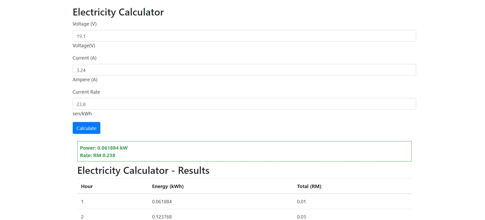

# Electricity Calculator

This project is for my internship application. It is a simple electricity calculator web application written in PHP. It calculates the power, energy, and total charge based on the user's input of voltage, current, and rate.

## How to Use

1. Fill in the Voltage (V), Current (A), and Current Rate (sen/kWh) fields.
2. Click the "Calculate" button to see the results in the table below.

## Technologies Used

- PHP
- HTML
- CSS (Bootstrap 4)

